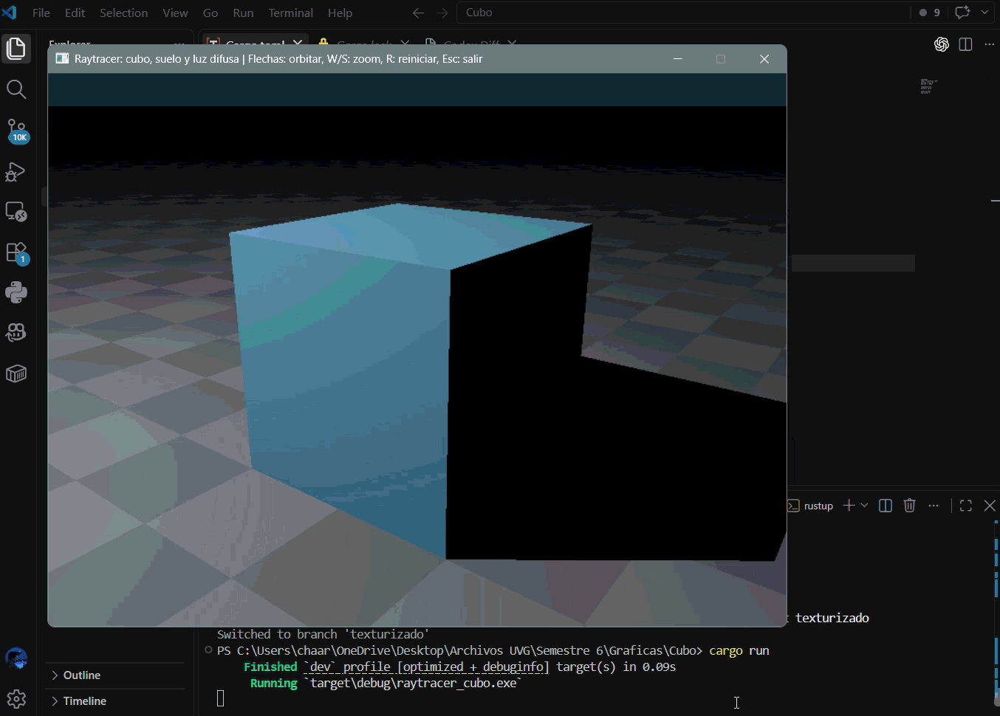

# Cubo en raytracer (Rust)

Demostración de ray tracing de un cubo sobre un suelo con iluminación **exclusivamente difusa** (Lambert). Incluye una luz puntual con atenuación por distancia, sombras duras proyectadas sobre el suelo y corrección gamma; no usa componente especular ni luz ambiente.

La cámara se calcula una sola vez por fotograma y los rayos primarios no se normalizan (no es necesario para estas intersecciones), reduciendo el trabajo de renderizado por píxel.

## Demostración



## Ejecutar

```powershell
cargo run --release
```

## Controles

- Flechas izquierda/derecha: rotación orbital horizontal.
- Flechas arriba/abajo: rotación orbital vertical.
- `W` / `S`: acercar / alejar la cámara.
- `R`: restaurar la vista inicial.
- `Esc`: cerrar.
